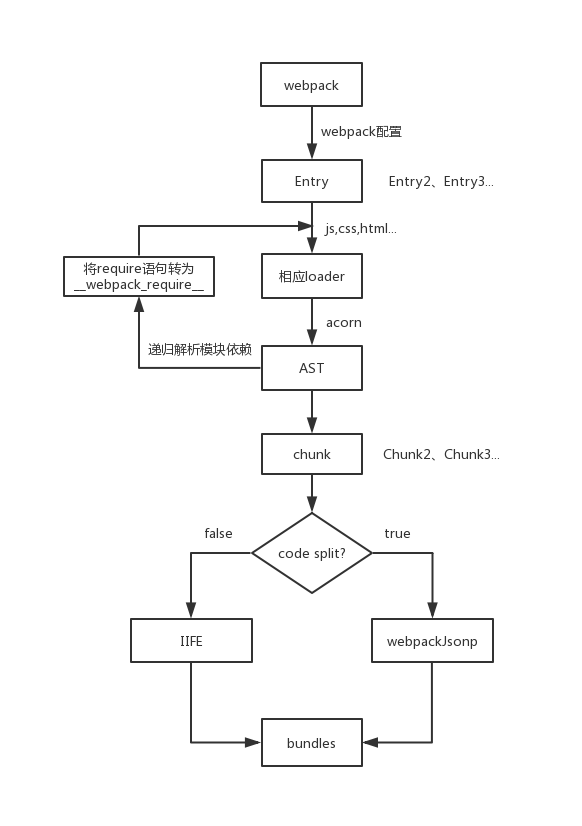

# webpack输出文件分析以及编写一个loader

## webpack构建流程

  webpack是时下最流行的前端打包构建工具，本质上是一个模块打包器，通过从入口文件开始递归的分析寻找模块之间的依赖，最终输出一个或多个bundle文件。

  webpack的构建是一个串行的流程，从启动到结束，会依次执行以下流程：

  1. 初始化配置
   
     从配置文件和命令行中读取参数并合并参数，生成最终的配置项，并且执行配置文件中的插件实例化语句，生成Compiler传入plugin的apply方法，为webpack事件流挂上自定义钩子；
  2. 开始编译

     生成compiler示例，执行compiler.run开始编译；
  3. 确定入口文件

     从配置项中读取所有的入口文件；
  4. 编译模块

     从入口文件开始编译，使用对应的loader编译模块，并且递归的编译当前模块所依赖的模块，在所有的模块都编译完成后，得到所有模块的最终内容和模块之间的依赖关系，最后将所有模块的 `require` 语句替换为 `__webpack_require__` 来模拟模块化操作；
  5. 资源输出

     根据入口和模块的依赖关系，组装成一个个包含多个模块的chunk，然后将chunk转换成一个单独的文件加入输出列表。
  6. 生成文件

     将生成的内容根据配置生成文件，输出到指定的位置。

  webpack的核心对象是Compile，负责文件的监听和启动编译，继承自Tapable[https://github.com/webpack/tapable]，使得Compile实例具备了注册和调用插件的功能。
  
  在webpack执行构建流程时，webpack会在特定的时机广播对应的事件，插件在监听到事件后，会执行特定的逻辑来修改模块的内容。

  通过下面这个流程图我们能够对webpack的构建流程有个更直观的印象：

  

  <center>webpack运行流程图</center >

## webpack输出文件分析

  下面，我们将通过分析webpack输出的bundle文件，了解bundle文件是如何在浏览器中运行的。


### 单文件分析

  首先创建 `src/index.js` ，执行一个最简单的js语句：

  ```javascript
  console.log('hello world')
  ```

  创建 `webpack.config.js`， 配置如下：

  ```javascript
  const path = require('path')

  module.exports = {
    mode: 'none',
    entry: './src/index.js',
    output: {
      path: path.resolve(__dirname, 'dist')
    }
  }
  ```

  本例中使用的webpack版本为4.35.3，此处为了更好的分析输出的bundle文件，将mode设置为'none'，此时webpack不会默认启用任何插件。

  mode有三个可选值，分别是'none'、'production'、'development'，默认值为'production'，默认开启以下插件：

   - FlagDependencyUsagePlugin：编译时标记依赖；
   - FlagIncludedChunksPlugin：标记子chunks，防止多次加载依赖；
   - ModuleConcatenationPlugin：作用域提升(scope hosting)，预编译功能，提升或者预编译所有模块到一个闭包中，提升代码在浏览器中的执行速度；
   - NoEmitOnErrorsPlugin：在输出阶段时，遇到编译错误跳过；
   - OccurrenceOrderPlugin：给经常使用的ids更短的值；
   - SideEffectsFlagPlugin：识别 package.json 或者 module.rules 的 sideEffects 标志（纯的 ES2015 模块)，安全地删除未用到的 export 导出；
   - TerserPlugin：压缩代码

  mode值为'development'时，默认开启以下插件：

  - NamedChunksPlugin：以名称固化chunkId；
  - NamedModulesPlugin：以名称固化moduleId

  执行webpack构建命令：

  ```bash
  $ webpack
  ```

  输出到dist文件夹中的 `main.js` 文件内容如下：

  ```javascript
 (function(modules) { // webpackBootstrap
// 模块缓存
var installedModules = {};

// 模块加载函数
function __webpack_require__(moduleId) {

	// 如果加载过该模块，则直接从缓存中读取
	if(installedModules[moduleId]) {
		return installedModules[moduleId].exports;
	}
	// 创建新模块并将其缓存起来
	var module = installedModules[moduleId] = {
		i: moduleId,
		l: false,
		exports: {}
	};

	// 执行模块函数，设置module.exports
	modules[moduleId].call(module.exports, module, module.exports, __webpack_require__);

	// 将module标记为已加载
	module.l = true;

	// 返回设置好的module.exports
	return module.exports;
}


// 指向modules
__webpack_require__.m = modules;

// 指向缓存
__webpack_require__.c = installedModules;

// 定义exports的get方式
__webpack_require__.d = function(exports, name, getter) {
	if(!__webpack_require__.o(exports, name)) {
		Object.defineProperty(exports, name, { enumerable: true, get: getter });
	}
};

// 设置es6模块标记
__webpack_require__.r = function(exports) {
	if(typeof Symbol !== 'undefined' && Symbol.toStringTag) {
		Object.defineProperty(exports, Symbol.toStringTag, { value: 'Module' });
	}
	Object.defineProperty(exports, '__esModule', { value: true });
};

// create a fake namespace object
// mode & 1: value is a module id, require it
// mode & 2: merge all properties of value into the ns
// mode & 4: return value when already ns object
// mode & 8|1: behave like require
__webpack_require__.t = function(value, mode) {
	if(mode & 1) value = __webpack_require__(value);
	if(mode & 8) return value;
	if((mode & 4) && typeof value === 'object' && value && value.__esModule) return value;
	var ns = Object.create(null);
	__webpack_require__.r(ns);
	Object.defineProperty(ns, 'default', { enumerable: true, value: value });
	if(mode & 2 && typeof value != 'string') for(var key in value) __webpack_require__.d(ns, key, function(key) { return value[key]; }.bind(null, key));
	return ns;
};

// 兼容commonjs和es6模块
__webpack_require__.n = function(module) {
	var getter = module && module.__esModule ?
		function getDefault() { return module['default']; } :
		function getModuleExports() { return module; };
	__webpack_require__.d(getter, 'a', getter);
	return getter;
};

// Object.prototype.hasOwnProperty的封装
__webpack_require__.o = function(object, property) { return Object.prototype.hasOwnProperty.call(object, property); };

// webpack配置的publicpath
__webpack_require__.p = "";


// 加载模块并返回
return __webpack_require__(__webpack_require__.s = 0);
 })
/************************************************************************/
 ([
/* 0 */
/***/ (function(module, exports) {

console.log('hello world')

/***/ })
 ]);
```

可以看到输出的代码是个IIFE（立即执行函数），可以简化如下：

```javascript
(function(modules) {
  var installedModules = {};

  // webpack require语句
  // 加载模块
  function __webpack_require__(moduleId) {}

  return __webpack_require__(0)
})([
  function(module, exports) {
    console.log('hello world')
  }
])
```

简化后代码中的 `__webpack_require__` 函数起到的就是加载模块的功能，IIFE函数接收的参数是个数组，第0项内容便是 `src/index.js` 中的代码语句，通过 `__webpack_require__` 函数加载并执行模块，最终在浏览器控制台输出 `hello world`。

接下来我们通过代码分析下 `__webpack_reuqire__` 函数内部是如何工作的

```javascript
function __weboack_require__(moduleId) {
  // 如果已经加载过该模块，则从缓存中直接读取
  if (installedModules[moduleId]) {
    return installedModules[moduleId].exports;
  }

  // 如果没有加载过该模块，则创建一个新的module存入缓存中
  var module = installedModules[moduleId] = {
  	i: moduleId, // module id
  	l: false, // 是否已加载 false
  	exports: {} // 模块导出
  };

  // 执行该module
  // call方法第一个参数为modules.exports，是为了module内部的this指向该模块
  // 然后传入三个参数，分别为module, module.exports, __webpack_require__模块加载函数
  modules[moduleId].call(module.exports, module, module.exports, __webpack_require__);

  // 设置module为已加载
  module.l = true;

  // 最终返回module.exports
  return module.exports;
  }
}
```

可以看到 `__webpack_require__` 函数接收一个模块id，通过执行该模块，最终返回该模块的exports，并将模块缓存在内存中。如果再次加载该模块， 则直接从缓存中读取。 `modules[modulesId]` 的内容是IIFE参数的第0项，即：

```javascript
function(module, exports) {
  console.log('hello world')
}
```

在导出的IIFE中，除了 `__webpack_require__` 函数，还在 `__webpack_require__` 下挂载了很多属性.

- `__webpack_require__.m` : 挂载所有的modules；
- `__webpack_require__.c` : 挂载已缓存的modules；
- `__webpack_require__.d` : 定义exports的getter；
- `__webpack_require__.r` : 将module设置为es6模块；
- `__webpack_require__.t` : 根据不同的场景返回对应处理后的模块或值；
- `__webpack_require__.n` : 返回getter，内部区分是否为es6模块；
- `__webpack_require__.o` : Object.prototype.hasOwnProperty功能封装；
- `__webpack_require__.p` : output配置项中的publicPath属性；


### 多文件引用分析

在前面的例子中，webpack打包的bundle中只包含一个非常简单的入口文件，并不存在模块之间的引用。

下面我们修改下 `src/index.js` 中的代码，引用一个ES6模块 `src/math.js` 进来：

```javascript
// math.js
const add = function (a, b) {
  return a + b
}

export default add
```

```javascript
// index.js
import add from './math'

console.log(add(1, 2))
```

重新执行webpack打包命令，可以看到输出的IIFE中的参数已经变成了两项：

```javascript
([
/* 0 */
/***/ (function(module, __webpack_exports__, __webpack_require__) {

"use strict";
__webpack_require__.r(__webpack_exports__);
/* harmony import */ var _math__WEBPACK_IMPORTED_MODULE_0__ = __webpack_require__(1);


console.log(Object(_math__WEBPACK_IMPORTED_MODULE_0__["default"])(1, 2))


/***/ }),
/* 1 */
/***/ (function(module, __webpack_exports__, __webpack_require__) {

"use strict";
__webpack_require__.r(__webpack_exports__);
const add = function (a, b) {
  return a + b
}

/* harmony default export */ __webpack_exports__["default"] = (add);


/***/ })
 ]);
```

数组第1项中定义了 `math.js` 模块，并且通过执行 `__webpack_require__.r(__webpack_exports__)` 使得webpack能够识别出该模块是个ES6模块，最后将 `__webpack_exports__` 的 `default` 属性值设置为函数 `add` 。

数组第0项是 `index.js` 打包后输出的模块，语句 `var _math__WEBPACK_IMPORTED_MODULE_0__ = __webpack_require__(1)` 的功能即是将模块 `math.js` 导出的 `add` 函数引进来， `__webpack_require__(1)` 返回 `module.exports`，其中 `1` 是由webpack在打包时生成的chunkId，最后通过 `console.log(Object(_math__WEBPACK_IMPORTED_MODULE_0__["default"])(1, 2))` 执行 `index.js` 中的语句。

webpack通过将原本独立的一个个模块存放到IIFE的参数中来加载，从而达到只进行一次网络请求便可执行所有模块，避免了通过多次网络加载各个模块造成的加载时间过长的问题。并且在IIFE函数内部，webpack也对模块的加载做了进一步优化，通过将已经加载过的模块缓存起来存在内存中，第二次加载相同模块时便直接从内存中取出。


### 异步加载分析

上面两个例子都是同步加载模块并执行，但是在实际项目中为了提高页面的加载速度，往往对首屏初始化时暂时用不到的模块进行异步加载，比如从首页跳转后的路由模块等。接下来我们将通过异步加载的方式来加载 `math.js` 模块并执行其导出的 `add` 函数。

```javascript
import('./math').then((add) => {
  console.log(add(1, 2))
})
```

重新打包后，输出 `main.js` 和 `1.js`，`1.js` 是需要异步加载的文件。

先分析入口文件 `main.js` ，可以看到相对于同步加载方式的代码输出，文件中多了 `__webpack_require__.e` 和 `webpackJsonpCallback` 函数，IIFE中的参数也只有一个：

```javascript
/***/ (function(module, exports, __webpack_require__) {


__webpack_require__.e(/* import() */ 1).then(__webpack_require__.bind(null, 1)).then((add) => {
  console.log(add(1, 2))
})


/***/ })
```

该模块通过 `__webpack_require__.e(1)` 的方式加载模块1的文件，加载成功后再通过执行 `__webpack_require__.bind(null, 1)` 返回模块1，然后执行该模块导出的 `add` 函数。

 `__webpack_require__.e` 的作用便是加载需要异步加载的模块，函数的内容如下：

 ```javascript
 __webpack_require__.e = function requireEnsure(chunkId) {
  var promises = [];

  var installedChunkData = installedChunks[chunkId];
  if (installedChunkData !== 0) { // 如果为0则代表已经加载过该模块

    // installedChunkData 不为空且不为0表示该 Chunk 正在网络加载中
    // 直接返回promise对象
    if (installedChunkData) {
      promises.push(installedChunkData[2]);
    } else {
      // 该chunk从未被加载过，返回数组包含三项，分别是resolve，reject和创建的promise对象
      var promise = new Promise(function (resolve, reject) {
        installedChunkData = installedChunks[chunkId] = [resolve, reject];
      });
      promises.push(installedChunkData[2] = promise);

      // 创建script标签，加载模块
      var script = document.createElement('script');
      var onScriptComplete;

      script.charset = 'utf-8';
      script.timeout = 120;
      if (__webpack_require__.nc) {
        script.setAttribute("nonce", __webpack_require__.nc);
      }

      // jsonpScriptSrc的作用是返回根据配置的publicPath和chunkId生成的文件路径
      script.src = jsonpScriptSrc(chunkId);

      // 创建一个Error实例，用于在加载错误时catch
      var error = new Error();
      onScriptComplete = function (event) {
        // 防止内存泄漏
        script.onerror = script.onload = null;
        clearTimeout(timeout);
        var chunk = installedChunks[chunkId];

        if (chunk !== 0) {
          if (chunk) {
            // chunk加载失败，抛出错误
            var errorType = event && (event.type === 'load' ? 'missing' : event.type);
            var realSrc = event && event.target && event.target.src;
            error.message = 'Loading chunk ' + chunkId + ' failed.\n(' + errorType + ': ' + realSrc + ')';
            error.name = 'ChunkLoadError';
            error.type = errorType;
            error.request = realSrc;
            chunk[1](error);
          }
          installedChunks[chunkId] = undefined;
        }
      };

      // 异步加载最长等待时间120s
      var timeout = setTimeout(function () {
        onScriptComplete({ type: 'timeout', target: script });
      }, 120000);
      script.onerror = script.onload = onScriptComplete;

      // 将创建的script标签插入dom中
      document.head.appendChild(script);
    }
  }
  return Promise.all(promises);
};
 ```

函数内部先判断是否加载过该模块，如果没有加载过，则创建一个`script`标签，`script`的路径是通过内部的 `jsonpScriptSrc` 函数根据webpack的配置生成最终的src路径返回得到。函数最终返回一个 `Promise` 对象，js文件加载失败时则会执行 `reject`将错误抛出。

`math.js` 输出的bundle `1.js` 的内容很简单，代码如下：

```javascript
(window["webpackJsonp"] = window["webpackJsonp"] || []).push([[1],[
/* 0 */,
/* 1 */
/***/ (function(module, __webpack_exports__, __webpack_require__) {

"use strict";
__webpack_require__.r(__webpack_exports__);
const add = function (a, b) {
  return a + b
}

/* harmony default export */ __webpack_exports__["default"] = (add);


/***/ })
]]);
```

可以看到该bundle的作用就是向 `window['webpackJsonp']` 数组中push了一个新的数组，其中第一项 `[1]` 是webpack生成的chunkId，第二项是 `math.js` 转换后的模块具体内容。

与此同时，在 `main.js` 中IIFE的后部分，对挂载在全局的 `window['webpackJsonp']` 数组的push方法进行了重写，指向了在前面定义过的 `webpackJsonpCallback` 函数：

```javascript
function webpackJsonpCallback(data) {
	var chunkIds = data[0];
	var moreModules = data[1];
	// 将data第1项模块添加到modules中,
	// 然后将对应的chunkId标记为已加载
	var moduleId, chunkId, i = 0, resolves = [];
	for(;i < chunkIds.length; i++) {
		chunkId = chunkIds[i];
		if(installedChunks[chunkId]) {
			resolves.push(installedChunks[chunkId][0]);
		}
		installedChunks[chunkId] = 0;
	}

	// 将传进来的moreModules数组中的每一个模块依次添加到IIFE中缓存的modules中
	for(moduleId in moreModules) {
		if(Object.prototype.hasOwnProperty.call(moreModules, moduleId)) {
			modules[moduleId] = moreModules[moduleId];
		}
	}

	// parentJsonpFunction为window['webpackJsonp']中原声的数组push方法
	// 执行parentJsonpFunction将data真正的添加到window['webpackJsonp']数组中去
	if(parentJsonpFunction) parentJsonpFunction(data);

	// 将前面创建的promise执行resolve
	while(resolves.length) {
		resolves.shift()();
	}
};
```

通过分析 `webpackJsonpCallback` 函数的内容，可以看到该函数的主要作用是将传入的chunkid标记为已加载，并将传入的模块挂在到缓存模块的 `modules` 对象上，最终执行 `__webpack_require__.e` 函数返回的promise对象的resolve方法代表该异步加载的模块已经加载完成，此时，在 `__webpack_require__.e(1).then()` 中便可以通过同步加载模块的方式加载该模块啦。

重新梳理一下入口主文件加载异步模块的大概流程：

1. 执行	`__webpack_require__.e` 加载异步模块；
   
2. 创建chunkid对应的script标签加载脚本，并返回promise；
   
3. 如果加载失败，reject掉promise；如果加载成功，异步chunk立即执行 `window[webpackJsonp]` 的push方法，将模块标记为已加载，并resolve掉相应的promise；
   
4. 成功后可在 `__webpack_require__.e().then` 中以同步的方式加载模块。

### 输出文件总结

在webpack输出的文件中，通过IIFE的形式将所有模块作为参数都传递进来，用 `__webpack_require__` 模拟import或者require语句，然后从入口模块开始依次递归的执行加载模块，需要异步加载的模块，通过在dom上插入一个新的script标签加载。并且内部对模块加载做了缓存处理优化。

在实际的项目中，输出的bundle内容会远比本文中的demo复杂的多，并且会有chunkId设置，公共chunk抽取，代码压缩混淆等优化，但是可以通过这个最基本的demo，熟悉webpack输出的文件在运行时的工作流程，便于我们在调试时更好的分析。


## 编写一个简单的loader

在编写一个loader之前，先简单介绍下webpack loader的作用。在webpack中，可以将loader理解为一个转换器，通过处理文件的输入，返回一个新的结果，最终交给webpack进行下一步的处理。

一个loader就是一个nodejs模块，它的基本结构如下:

```javascript
// 可以通过loader-utils这个包获取该loader的配置项options
const loaderUtils = require('loader-utils')

// 导出一个函数，source为webpack传递给loader的文件源内容
module.exports = function(source) {
  // 获取该loader的配置项
  const options = loaderUtils.getOptions(this)

  // 一些转换处理，最终返回处理后的结果。
  return source
}

```

在平时配置webpack loader的时候，都是使用通过npm安装的loader，为了加载本地的loader，一般有两种方式，第一种是通过npm link的方式将loader关联到项目的node_modules下，还有一种方式是通过配置wepack的resolveLoader.modules配置项，告诉webpack通过何种形式寻找loader。第一种方式需要配置相关的 `package.json` ，在本例中使用第二种方式配置。

```javascript
module.exports = {
  resolveLoader: {
    // 假设本地编写的loader在loaders文件夹下
    modules: ['node_modules', './loaders/']
  }
}
```

下面我们编写一个loader，用于删除代码中的注释。命名为remove-comment-loader：

```javascript

module.exports = function(source) {
  // 匹配js中的注释内容
  const reg = new RegExp(/(\/\/.*)|(\/\*[\s\S]*?\*\/)/g)

  // 删除注释
  return source.replace(reg, '')
}

```

然后修改webpack.config.js：

```javascript
const path = require('path')

module.exports = {
  mode: 'none',
  entry: './src/index.js',
  module: {
    rules: [
      {
        test: /\.js$/,
        loader: 'remove-comment-loader' // 当匹配到js文件时，使用我们编写的remove-comment-loader
      }
    ]
  },
  output: {
    path: path.resolve(__dirname, 'dist')
  },
  resolveLoader: {
    modules: ['node_modules', './loaders/'] // 配置加载本地loader
  }
}
```

然后在入口文件代码中加上一些注释，重新打包查看输出文件，就能看到代码中的注释已经被删除了。

本文中的demo代码参见；https://github.com/duwenbin0316/webpack-runtime-demo

在此处顺便向大家推荐下民生科技公司Firefly移动金融开发平台中的前端打包构建工具apollo-build。apollo-build包含开发调试、打包、测试、
和打包dll的功能，并且提供了非常好用的前端接口Mock功能，命令行体验和create-react-app一致。我们封装了webpack中的大部分常用功能并在内部做了很多优化，从中提取出了最常用的配置项，即使不熟悉webpack的配置也能快速上手，并且也支持通过 `webpack.config.js` 的方式做高阶的修改，欢迎访问民生科技官网了解。

## 参考

<hr />

《深入浅出webpack》 - 吴浩麟

[Webpack揭秘——走向高阶前端的必经之路](https://imweb.io/topic/5baca58079ddc80f36592f1a)

## 作者介绍

杜文斌

民生科技有限公司用户体验技术部前端开发工程师
